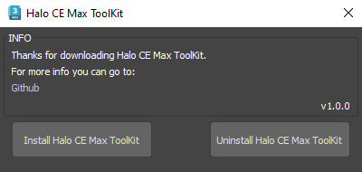
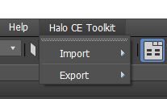
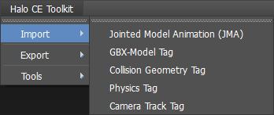
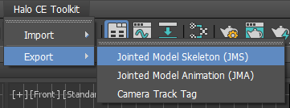

# HALO CE MAX TOOLKIT

A toolkit for Autodesk 3ds Max that allows you to **IMPORT AND EXPORT SOURCE AND TAG FILES** for Halo Custom Edition.

This toolkit uses some of  the original scripts from the [BlueStreak](https://github.com/Sledmine/bluestreak/tree/main) project. And another are rewritten from scratch to improve stability, usability, and add new features.

## Features
- Import Halo CE **GBX/XBOX Models**, **Camera Tracks**, **Animation Data**, **Physics Mass Points**, and **Collision Geometry** directly into 3ds Max.  
- Export **JMS**, **Animation Data** and **Camera Track** files compatible with Halo CE.
- Integrated directly into 3ds Max menus for easy access (no need to manually run scripts).
- Additional validations and error handling compared to the original BlueStreak scripts.
- Adds a new **Halo CE Toolkit** menu section inside 3ds Max for quick access to import/export tools.
- Uninstall the Toolkit with installer dialog.

If you wanna know more about the features and roadmap, check the [**Project Wiki**](https://github.com/markmcfuzz/HaloCE-Max-Toolkit/wiki).

---
### Dependencies
- **Autodesk 3ds Max 2023** or later (may work on 2019+)

## Installation  

1. Download the latest package from the [**Releases**](https://github.com/markmcfuzz/HaloCE-Max-Toolkit/releases) page.  
2. In 3ds Max, go to **Scripting > Run Script**, select the `.mzp` file.  
3. Follow the installer dialog to install the toolkit.  

After installation, the new **Halo CE Toolkit** menu will appear automatically.  

## Screenshots
### Installer UI

### Halo CE Toolkit Menu 

### Import Options 

### Export Options 

## FAQ / Troubleshooting  

- **Will there be more tools in the future?**  
  > Yes! New tools and features are planned based on user feedback and project needs. Stay tuned for updates via the repository or official release channels.

- **I can't drag and drop the .mzp to install the toolkit**  
  > Make sure you are dragging the **`.mzp`** file into the **3ds Max viewport** (the 3D view), not the toolbar or other UI areas. If nothing happens or 3ds max blocks to drop the file, go to **Scripting > Run Script**, then select the **`.mzp`** file manually.

- **Can I install this in older versions of 3ds Max?**  
  > The toolkit is built for **3ds Max 2023** and later, but may work on older versions **(2019+)**.

## Special Thanks:

- [Sledmine](https://github.com/Sledmine)
  - Modified scripts from [BlueStreak](https://github.com/Sledmine/bluestreak/tree/main)
- [Sigmmma](https://github.com/Sigmmma)
  - H1 Tag Definitions
- General-101
  - Some math used in the Halo 1 tag importing code.
  - [Halo-Asset-Blender-Development-Toolset](https://github.com/General-101/Halo-Asset-Blender-Development-Toolset)
- MosesofEgypt
  - Camera track exporter.
- TheGhost
  - Initial JMS exporter.
- CtrlAltDestroy
  - Initial animation exporter.
- LaikaGlove
  - Initial animation source importer.