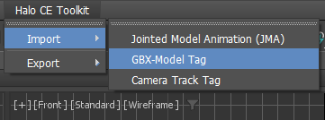

# HALO CE MAX TOOLKIT

A toolkit for Autodesk 3ds Max that allows you to **import and export source and tag files** for Halo Custom Edition. 

> [!NOTE]
> This toolkit is **not a modification of Bluestreak**. Although it covers all the functionality Bluestreak once offered, every tool has been rewritten from scratch, resulting in a faster, cleaner, and more robust system. In addition to major performance and workflow improvements, the toolkit introduces brand-new tools and features never seen before, designed to enhance productivity and modernize the 3ds Max pipeline.

If you want to learn more in depth about the features and roadmap, check the [**Project Wiki**](https://github.com/markmcfuzz/HaloCE-Max-Toolkit/wiki).

## Features
### Import:
  - `GBX Model`
  - `Camera Track`
  - `Animation Data (JMA)`
  - `Jointed Model Skeleton (JMS)`
  - `Physics Mass Points`
  - `Model Collision Geometry`
### Export:
 - `JMS`
 - `JMA`
 - `Camera Track`
### Tools:
 - `Sphere to Halo Marker Helper`
    - Change the spheres with symbol `#` to new Halo Marker helpers.
- Integrated directly into 3ds Max menus for easy access (no need to manually run scripts).
- Additional validations and clear error handling for JMS Exporter.
- Improved performance for large models and animations compared to bluestreak.
- Adds a new **Halo CE Toolkit** menu section inside 3ds Max for quick access to import/export/tools.
- Executable installer for easy installation and uninstallation of the toolkit.

---
### Dependencies
- **Autodesk 3ds Max 2023 - 2026**
  > [!WARNING]
  > 3ds Max **< 2023** is not officially supported, but may work.

## Installation  
1. Download the latest executable from the [**Releases**](https://github.com/markmcfuzz/HaloCE-Max-Toolkit/releases) page.
2. If you have an older version (valid from version 4.0.0 onwards) of Halo CE Max Toolkit installed, simply install the new version over it.
    > [!IMPORTANT]
    > _`.mzp` versions are deprecated, if you still have one of them, uninstall it with the same .mzp executed as script inside 3ds Max._
3. Install the `HCE Max Toolkit.exe` with 3ds Max closed.
4. Open 3ds Max and you see the "**Halo CE Toolkit**" menu in the main menu bar. 

After installation, open 3ds max and the new **Halo CE Toolkit** menu will appear in the main menu bar automatically.

> [!TIP]
> For any issues or questions, please refer to the [**FAQ section**](https://github.com/markmcfuzz/HaloCE-Max-Toolkit?tab=readme-ov-file#faq--troubleshooting) below or open an issue on the GitHub repository.

## Screenshots

### Import Menu 

### Export Menu 

### Tools Menu

## FAQ / Troubleshooting  

- **Will there be more tools in the future?**  
  > Yes! New tools and features are planned based on user feedback and project needs. Stay tuned for updates via the repository or official release channels.

- **Why change from .mzp to .exe?**
  > Because the project changed to Autodesk Application Plug-in Package format, an executable is the most convenient option. 

- **Can I install this in older versions of 3ds Max?**  
  > The toolkit is built for **3ds Max 2023** and later, but may work on older versions. If you are using an older version, please report any issues you encounter.

- **How beta build works?**
  > Beta builds are experimental versions that may contain new features or bug fixes not yet available in stable releases. They are intended for testing and feedback purposes. Use beta builds at your own risk, as they may be less stable than official releases and they are on zip format, so you need to manually install them by copying the `HCEMaxToolkit` and paste in the next path: `C:\Users\yourUserName\AppData\Roaming\Autodesk\ApplicationPlugins`.

- **Alternative get updated?**  
  > For more advanced users can follow these steps for get updated using symbolic link:
  https://github.com/markmcfuzz/HaloCE-Max-Toolkit/wiki/Advanced-Users

- **Can I contribute to the project?**  
  > Yes! Contributions are welcome. You can contribute by reporting issues, suggesting features, or submitting pull requests on the GitHub repository.

## Special Thanks:

- TheGhost
  - All original bluestreak scripts. At the start of this project.
- [Sledmine](https://github.com/Sledmine)
  - Modified scripts from [BlueStreak](https://github.com/Sledmine/bluestreak/tree/main)
- [Sigmmma](https://github.com/Sigmmma)
  - H1 Tag Definitions
- General-101
  - Some math used in the Halo 1 tag importing code and project structure inspiration.
  - [Halo-Asset-Blender-Development-Toolset](https://github.com/General-101/Halo-Asset-Blender-Development-Toolset)
- MosesofEgypt
  - Camera track exporter.
- CtrlAltDestroy
  - Initial animation exporter.
- LaikaGlove
  - Initial animation source importer.